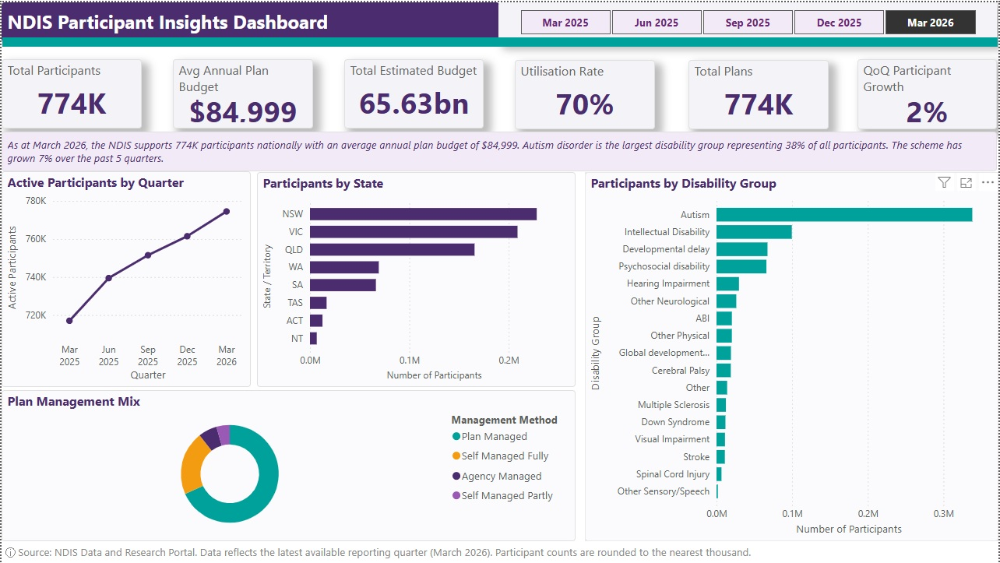
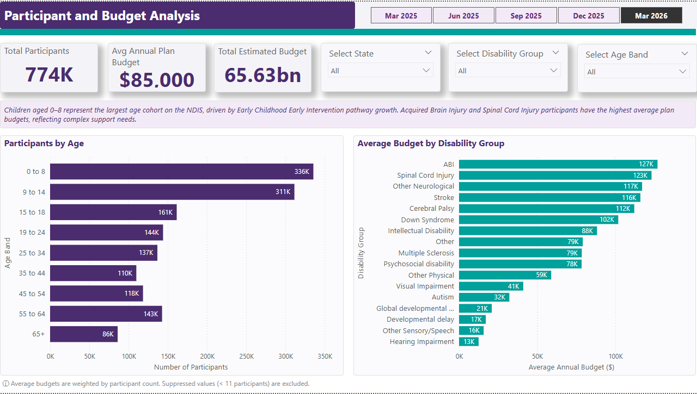
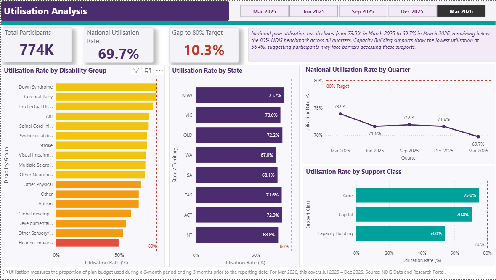
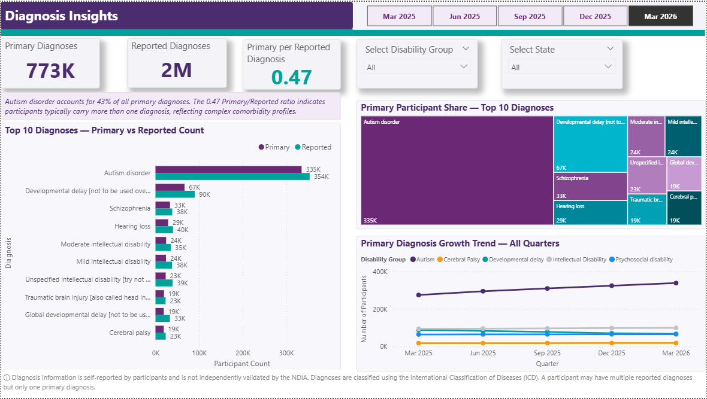
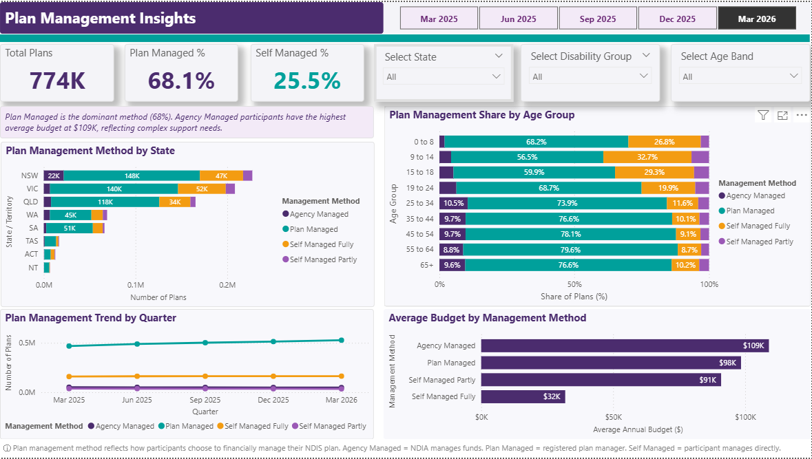
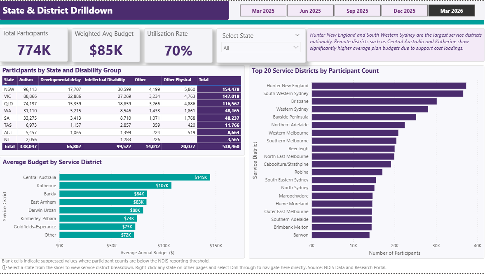
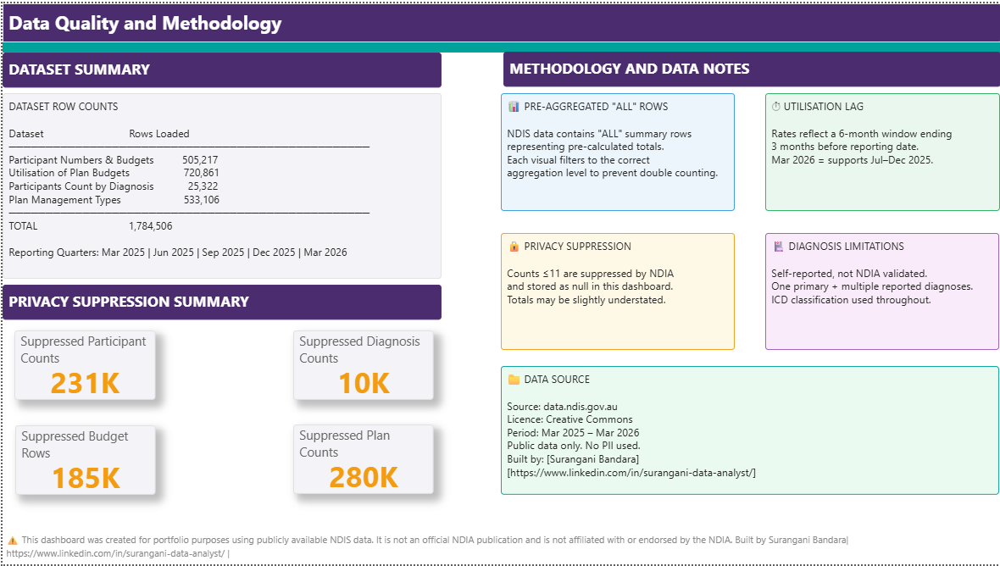

# 📊 NDIS Participant, Budget, Utilisation & Plan Management Insights Dashboard


> A 7-page interactive Power BI dashboard analysing 1.78 million rows of public NDIS data across 5 quarters (March 2025 – March 2026), surfacing trends in participant growth, plan budgets, support utilisation, diagnosis profiles, and plan management types.

---

## 📋 Table of Contents

- [Project Overview](#project-overview)
- [Dashboard Pages](#dashboard-pages)
- [Data Sources](#data-sources)
- [Technical Implementation](#technical-implementation)
- [Key Insights](#key-insights)
- [Screenshots](#screenshots)
- [How to View](#how-to-view)
- [Folder Structure](#folder-structure)
- [Data Disclaimer](#data-disclaimer)
- [About the Author](#about-the-author)

---

## 🔍 Project Overview

The **National Disability Insurance Scheme (NDIS)** is one of Australia's largest social policy programs, supporting hundreds of thousands of Australians with permanent and significant disability. The NDIA releases quarterly public datasets that provide transparency into scheme performance — but these datasets require significant transformation and analytical effort to extract meaningful insights.

This project transforms raw NDIA public data into a fully interactive, executive-ready Power BI dashboard designed for:

- **Scheme analysts and planners** tracking participant growth and budget trends
- **Plan managers and support coordinators** benchmarking utilisation patterns
- **Policy and strategy teams** monitoring quarter-on-quarter shifts in plan management types
- **Data professionals** demonstrating applied analytics in a complex government dataset context

| Metric | Detail |
|---|---|
| **Dashboard Pages** | 7 |
| **Total Data Rows** | 1,784,506 |
| **Datasets** | 4 |
| **Time Period** | March 2025 – March 2026 (5 quarters) |
| **Data Source** | NDIA Public Quarterly Reports |
| **Tool** | Microsoft Power BI Desktop |
| **Skills** | DAX, Power Query (M), Data Modelling, UX Design |

---

## 📑 Dashboard Pages

### Page 1 — Executive Overview
*Landing page · National scheme snapshot*

The entry point to the dashboard. Provides a national snapshot of the NDIS scheme for a selected quarter, giving stakeholders an immediate high-level view before drilling into detail pages.

**KPI Cards:** 774K Total Participants · $84,999 Avg Plan Budget · $65.63bn Total Estimated Budget · 70% Utilisation Rate · 774K Total Plans · 2% QoQ Participant Growth

**Visuals:** Active Participants by Quarter (line) · Participants by State (bar) · Participants by Disability Group (bar) · Plan Management Mix (donut)

> 💡 *Autism disorder is the largest disability group representing 38% of all participants. The scheme has grown 7% over 5 quarters.*

---

### Page 2 — Participant & Budget Analysis
*Demographics & spend*

Explores who is on the NDIS by age group and how plan budgets differ across disability types. Allows filtering by state, disability group, and age band to identify where funding is concentrated.

**KPI Cards:** 774K Total Participants · $85,000 Avg Annual Plan Budget · $65.63bn Total Estimated Budget

**Visuals:** Participants by Age Group · Avg Budget by Disability Group

**Slicers:** Select State · Select Disability Group · Select Age Band

> 💡 *Children aged 0–8 are the largest age cohort driven by Early Childhood Early Intervention growth. ABI and Spinal Cord Injury have the highest average plan budgets, reflecting complex support needs.*

---

### Page 3 — Utilisation Analysis
*Plan spending efficiency*

Measures how effectively participants are spending their plan budgets against the 80% NDIS benchmark. Shows utilisation trends over time and breaks down performance by disability group, state, and support class.

**KPI Cards:** 774K Total Participants · 69.7% Utilisation Rate · 10.3% Gap to 80% Target

**Visuals:** National Utilisation Rate by Quarter (line) · Utilisation by Disability Group (bar) · Utilisation by State (bar) · Utilisation by Support Class (bar)

> 💡 *Utilisation declined from 73.9% to 69.7% over 5 quarters — remaining below the 80% benchmark. Capacity Building supports show the lowest utilisation at 54%, suggesting barriers to access.*

---

### Page 4 — Diagnosis Insights
*Clinical profile*

Analyses the primary and reported diagnosis profile of NDIS participants using ICD classifications. Compares the volume of primary vs secondary reported diagnoses and tracks growth trends across major disability groups over time.

**KPI Cards:** 773K Primary Diagnoses · 2M Reported Diagnoses · 0.47 Primary per Reported

**Visuals:** Top 10 Primary vs Reported — clustered bar · Treemap — Primary Diagnosis Share · Primary Diagnosis Growth Trend (line)

> 💡 *Autism disorder accounts for 43% of all primary diagnoses. A ratio of 0.47 confirms most participants carry multiple reported conditions, reflecting high comorbidity across the scheme.*

---

### Page 5 — Plan Management Insights
*Financial management*

Examines how participants choose to financially manage their NDIS plans across the four management methods. Breaks down method preference by state and age group, and tracks how management patterns have shifted over 5 quarters. Includes average budget by method to surface cost differences.

**KPI Cards:** 774K Total Plans · 68.1% Plan Managed · 25.5% Self Managed

**Visuals:** Plan Management by State (bar) · Method Share by Age Group — 100% stacked bar · Management Trend by Quarter (line) · Avg Budget by Method (bar)

> 💡 *Plan Managed is dominant at 68%. Agency Managed participants have the highest average budget at $109K, reflecting complex support needs. Self-management is highest in younger age groups.*

---

### Page 6 — State & District Drilldown
*Geographic analysis*

Provides a deep geographic breakdown of participant distribution across states and service districts. The matrix cross-tabulates states against disability groups. District-level charts reveal which service areas have the highest participant volumes and most resource-intensive plan budgets. Supports drill-through navigation from all other pages.

**KPI Cards:** 774K Total Participants · $85K Weighted Avg Budget · 70% Utilisation Rate

**Visuals:** State × Disability Group Matrix · Top 20 Districts by Participant Count (bar) · Avg Budget by Service District (bar)

**Special Features:** Drill-through from all pages · Back button navigation

> 💡 *Hunter New England and South Western Sydney are the largest service districts nationally. Remote districts such as Central Australia ($145K) show significantly higher average budgets due to support cost loadings.*

---

### Page 7 — Data Quality & Methodology
*Governance & transparency*

A reference page that documents data sources, row counts, privacy suppression volumes, and key methodology decisions. Demonstrates professional data governance awareness and gives stakeholders full transparency into how the dashboard was built and what its limitations are.

**Suppression KPIs:** 231K Suppressed Participant Counts · 185K Suppressed Budget Rows · 280K Suppressed Plan Counts · 10K Suppressed Diagnosis Counts

**Methodology Notes Covered:** Pre-aggregated ALL rows · Utilisation lag explanation · Privacy suppression rules · Diagnosis data limitations · Data source & licence

**Dataset Row Counts:** 505,217 Participant & Budget · 720,861 Utilisation · 25,322 Diagnosis · 533,106 Plan Management · **1,784,506 Total**

> 💡 *This page is rare in portfolio dashboards and signals strong data governance maturity — exactly what NDIS and health analytics employers look for.*

---

## 🗂️ Data Sources

All data used in this project is **publicly available** and sourced from the official NDIA Quarterly Report publications.

| Dataset | Description | Rows (approx.) |
|---|---|---|
| Participant & Budget Data | Active participants by demographics, disability, age, state and approved plan budgets | ~505,000 |
| Utilisation Data | Support utilisation rates by disability group, state, and support class | ~721,000 |
| Diagnosis Data | Primary and reported diagnoses using ICD classifications | ~25,000 |
| Plan Management Data | Plan management method breakdown by participant cohort and quarter | ~533,000 |
| **Total** | | **1,784,506** |

**Quarters covered:**
- Q3 FY2025 — March 2025
- Q4 FY2025 — June 2025
- Q1 FY2026 — September 2025
- Q2 FY2026 — December 2025
- Q3 FY2026 — March 2026

📎 Source: [NDIS Data and Research Portal — data.ndis.gov.au](https://data.ndis.gov.au)

---

## ⚙️ Technical Implementation

### Data Transformation — Power Query (M)
- Ingested 4 separate quarterly CSV datasets and appended across 5 quarters into unified fact tables
- Applied consistent column naming, data type enforcement, and null handling across all datasets
- Built a custom **Date Dimension Table** in Power Query to support time intelligence functions
- Normalised inconsistent state/territory codes and disability category labels across quarterly files
- Created conditional columns for age groupings, utilisation bands, and plan management flags
- Documented privacy suppression volumes (rows with withheld counts) for data quality transparency

### Data Modelling
- Implemented a **star schema** with central fact tables and supporting dimension tables (Date, Geography, Support Class, Plan Type, Diagnosis)
- Established one-to-many relationships with correct cross-filter directions to prevent ambiguous results
- Separated measures into a dedicated **_Measures Table** for clean model organisation
- Configured drill-through filters on the State & District Drilldown page with back-navigation bookmarks

### DAX Measures (selected highlights)

```dax
-- Utilisation Rate %
Utilisation Rate % = 
DIVIDE(
    SUM(FactUtilisation[CommittedAmount]),
    SUM(FactUtilisation[ApprovedAmount]),
    0
)

-- Gap to 80% Benchmark
Gap to 80% Target = 
0.80 - [Utilisation Rate %]

-- Quarter-on-Quarter Participant Growth %
QoQ Participant Growth % = 
VAR CurrentQ = [Total Active Participants]
VAR PreviousQ = CALCULATE(
    [Total Active Participants],
    DATEADD('DimDate'[Date], -1, QUARTER)
)
RETURN DIVIDE(CurrentQ - PreviousQ, PreviousQ, BLANK())

-- Average Plan Budget
Avg Annual Plan Budget = 
DIVIDE(
    SUM(FactParticipantBudget[TotalEstimatedBudget]),
    DISTINCTCOUNT(FactParticipantBudget[PlanID]),
    0
)

-- Plan Managed % Share
Plan Managed % = 
DIVIDE(
    CALCULATE([Total Plans], FactPlanManagement[ManagementMethod] = "Plan Managed"),
    [Total Plans],
    0
)

-- Primary per Reported Diagnosis Ratio
Primary per Reported = 
DIVIDE(
    [Total Primary Diagnoses],
    [Total Reported Diagnoses],
    0
)
```

### Design Principles
- NDIS-aligned colour palette (purple/teal) with accessibility contrast compliance
- Drill-through navigation from all pages to State & District Drilldown with back button
- Slicers synced across pages for seamless cross-filtering by quarter, state, disability group, and age band
- Custom tooltips on key visuals providing supplementary context
- Page 7 included as a data governance reference — documenting suppression, methodology, and source licencing

---

## 💡 Key Insights

- **774K active participants** as at March 2026, with **7% scheme growth** over 5 quarters and a steady **2% QoQ growth rate**
- **Utilisation rate declined** from 73.9% to 69.7% across the 5-quarter period — remaining below the 80% NDIS benchmark, with Capacity Building supports the lowest at **54%**
- **Autism disorder** is the dominant disability group, representing **38% of all participants** and **43% of all primary diagnoses**
- **Plan Managed** is the dominant financial management method at **68.1%**, with Agency Managed participants having the highest average budget at **$109K** per plan
- **ABI and Spinal Cord Injury** cohorts have the highest average plan budgets, reflecting high-complexity support needs
- **Children aged 0–8** are the largest age cohort, driven by Early Childhood Early Intervention (ECEI) growth
- **Hunter New England and South Western Sydney** are the largest service districts; remote districts like Central Australia average **$145K per plan** due to support cost loadings
- High comorbidity is confirmed across the scheme — a **0.47 primary-to-reported diagnosis ratio** indicates most participants carry multiple reported conditions

---

## 🖼️ Screenshots

| Page | Preview |
|---|---|
| Executive Overview |  |
| Participant & Budget Analysis |  |
| Utilisation Analysis |  |
| Diagnosis Insights |  |
| Plan Management Insights |  |
| State & District Drilldown |  |
| Data Quality & Methodology |  |

---

## 👁️ How to View

### Option A — Power BI Service (Recommended)
View the published dashboard directly in your browser — no software required:
🔗 [View Live Dashboard](#) *(link to be added after publishing to Power BI Service)*

### Option B — Power BI Desktop
1. Download and install [Power BI Desktop](https://powerbi.microsoft.com/desktop/) (free)
2. Clone or download this repository
3. Open `NDIS_Insights_Dashboard.pbix`
4. Data is embedded — no external connections required

### Option C — PDF Export
A static PDF export of all 7 pages is available in the `/exports` folder for quick viewing without any software.

---

## 📁 Folder Structure

```
ndis-powerbi-dashboard/
│
├── NDIS_Insights_Dashboard.pbix       # Main Power BI file
│
├── screenshots/                       # Dashboard page screenshots
│   ├── 01_executive_overview.png
│   ├── 02_participant_budget_analysis.png
│   ├── 03_utilisation_analysis.png
│   ├── 04_diagnosis_insights.png
│   ├── 05_plan_management_insights.png
│   ├── 06_state_district_drilldown.png
│   └── 07_data_quality_methodology.png
│
├── exports/
│   └── NDIS_Insights_Dashboard.pdf
│
├── docs/
│   └── data_dictionary.md             # Column definitions and transformations
│
└── README.md
```

---

## ⚠️ Data Disclaimer

This dashboard uses **publicly available data** published by the National Disability Insurance Agency (NDIA) via the NDIS Data and Research Portal. All data has been used in accordance with the NDIA's open data licensing terms. No personally identifiable information (PII) is included in any dataset. Privacy suppression has been applied by the NDIA to small participant counts — this is documented in the Data Quality & Methodology page of the dashboard. This project is independent and not affiliated with or endorsed by the NDIA or the Australian Government.

---

## 👩‍💻 About the Author

**Surangani Bandara**
*Insights & Reporting Analyst — Forever Cornerstone*

An analyst working at the intersection of data and disability services, with hands-on experience translating complex NDIS scheme data into actionable insights for operational and strategic decision-making.

[](https://linkedin.com/in/[your-profile])
[](https://github.com/surangisns)

---

*Built with Microsoft Power BI · DAX · Power Query · Public NDIS Data*
